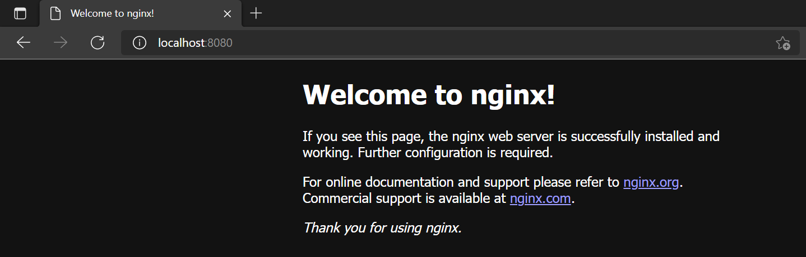

# Terraform: Introduction for developers

### Infrastructure as Code

Almost every software engineer has experienced that provisioning servers, operating systems, storage, and other infrastructure components is a demanding and time-consuming process. Provisioning is usually done manually, and when we take into account that in addition to the development environment, the staging and production workloads should also be deployed, we come to a large amount of work. In such a large task, human error can easily occur, which means that only a small configuration error can cause problems and disable the proper operation of the application.

To avoid potential outages we come to the concept of <b>Infrastructure as Code</b>. IaC is the managing and provisioning of infrastructure through code instead of through manual processes. Using the infrastructure as code allows configuration files on virtual machines, disks, network and other components to be stored together with the application code within source control management system. By storing them within the SCM allows you to version and track changes over time. This approach helps you to avoid undocumented, ad-hoc configuration changes.

Deploying your infrastructure as code also means that you can divide your infrastructure into modular components that can then be combined in different ways through automation. Automating infrastructure provisioning means that there is no need for manual interventions and thus eliminates the human error factor. There are several IaC tools and one of the most popular is <b>Terraform</b>.

### Terraform basic concepts

Terraform is HashiCorp's infrastructure as code tool. It lets you define resources and infrastructure in human-readable, declarative configuration files, and manages your infrastructure's lifecycle. It lets you define both cloud and on-premise resources trough configuration language called <b>HCL</b>, which looks like simplified JSON (JavaScript Object Notation). Terraform can manage low-level components like compute, storage, and networking resources, as well as high-level components like DNS entries and SaaS features.

But how does it all actually work under the hood? Terraform creates resources on cloud platforms and on-premises based on their application programming interfaces (APIs), while communication with APIs takes place through <b>providers</b>. Providers are plugins that interact with various platforms and manage their resources, serving as a logical abstraction of an upstream API.


Together with the community, Terraform has written more than 1800 providers, including those for major cloud providers like Azure, AWS and Google Cloud Platform. There are also providers for Docker, Kubernetes, Helm and more. You can find the full list at the [Terraform Registry](https://registry.terraform.io/).

As in everything else, the best way to learn Terraform is through practice, but keep in mind that creating resources on cloud providers can cost you money. If you no longer need certain resources after exercise, simply delete them and clean up your environment. Also, for practice you can use various free tiers on platforms like [Microsoft Azure](https://azure.microsoft.com/en-us/pricing/free-services/) and [Amazon Web Services](https://aws.amazon.com/free/) or some provider to create resources locally on your development machine. There is a lot of beginner friendly examples, like this one, on [HashiCorp Learn](https://learn.hashicorp.com/terraform) website which can help you get started.

### Demo: Terraform Docker provider

The complete source code for this demo is on GitHub, and you can find the repository [here](https://github.com/cvitaa11/terraform-demo).

We'll start with the `main.tf` file. Inside that file is placed `terraform {}` block which contains all the settings, including the required providers Terraform will use to provision your infrastructure components. Each provider consists of source attribute which defines where is provider actually located. By default it will be installed from the Terraform Registry, but optionally you can pass hostname parameter. In this example configuration, the `docker` provider's source is defined as `kreuzwerker/docker`.

The `version` attribute is optional, but it's highly recommended to use it so that Terraform does not install a version of the provider that does not work with your configuration. Each module should at least declare the minimum provider version it is known to work with, using the <b>>=</b> version constraint syntax. If the version is not passed, Terraform will download and install the latest one. Although this is not the case here, keep in mind that you can define multiple different providers in your configuration block and use them together.

```
terraform {
  required_providers {
    docker = {
      source = "kreuzwerker/docker"
    version = ">= 2.13.0" }
  }
}
```

Under the `provider` block we don't have much stuff, it just configures the specified provider, in this case `docker`.

The `resource` section is the most important part of every Terraform project. Each resource block describes one or more infrastructure components, which can be a physical or virtual object. Before the configuration block there are two parameters that define the resource type and its name. In this case we declare the Docker image and Docker container where both resources are named `nginx`.

```
resource "docker_image" "nginx" {
  name         = "nginx:latest"
  keep_locally = false
}

resource "docker_container" "nginx" {
  image = docker_image.nginx.latest
  name  = var.container_name
  ports {
    internal = 80
    external = 8080
  }
}
```

In the `docker_container` resource, under `image` parameter we are referencing previously declared `docker_image`. In the `ports` section we publish local port 80, which is the default for Nginx, to port 8080 on our local machine. For the container name, instead of some hard-coded string, we decided to use value assigned to a variable `container_name`.

You can name your configuration files however you want because Terraform loads all files in the current directory ending in `.tf`, but we choose to follow the naming convention and name the file `variables.tf`. Variables file is quite simple, each variable is declared by keyword and name. Inside the configuration block we define variable type, and can optionally pass default value or `sensitive` flag which limits Terraform UI output when the variable is used in configuration.

```
variable "container_name" {
  type = string
}
```

When variables are declared in your configuration, they can be set in a number of ways. They can be passed individually with the `-var` command line option, as environment variables in `TF_VAR_` format or inside variable definitions files (.tfvars). We used the latter option to set a name for our Docker container:

```
container_name = "nginx-example"
```

Now, we are ready to deploy our infrastructure and to do that we need to initialize a working directory containing Terraform configuration files with `terraform init` command. This command performs several different initialization steps in order to prepare the current working directory for use with Terraform which include downloading and installating the provider.

After the initialization process is complete we can create a new execution plan and then apply it. The easiest way to achieve this is by using `terraform apply` command. Execution plan is displayed in the command line and user is prompted to apply that plan. You should get similar output:

```
$ terraform apply

Terraform used the selected providers to generate the following execution plan. Resource actions are indicated with the following symbols:
  + create

Terraform will perform the following actions:

  # docker_container.nginx will be created
  + resource "docker_container" "nginx" {
      + attach           = false
      + bridge           = (known after apply)
      + command          = (known after apply)
      + container_logs   = (known after apply)
      + entrypoint       = (known after apply)
      + env              = (known after apply)
      + exit_code        = (known after apply)
      + gateway          = (known after apply)
      + hostname         = (known after apply)
      + id               = (known after apply)
      + image            = (known after apply)
      + init             = (known after apply)
      + ip_address       = (known after apply)
      + ip_prefix_length = (known after apply)
      + ipc_mode         = (known after apply)
      + log_driver       = (known after apply)
      + logs             = false
      + must_run         = true
      + name             = "nginx-example"
      + network_data     = (known after apply)
      + read_only        = false
      + remove_volumes   = true
      + restart          = "no"
      + rm               = false
      + security_opts    = (known after apply)
      + shm_size         = (known after apply)
      + start            = true
      + stdin_open       = false
      + tty              = false

      + healthcheck {
          + interval     = (known after apply)
          + retries      = (known after apply)
          + start_period = (known after apply)
          + test         = (known after apply)
          + timeout      = (known after apply)
        }


Do you want to perform these actions?
  Terraform will perform the actions described above.
  Only 'yes' will be accepted to approve.

  Enter a value: yes

docker_image.nginx: Creating...
docker_image.nginx: Still creating... [10s elapsed]
docker_image.nginx: Still creating... [20s elapsed]
docker_image.nginx: Still creating... [30s elapsed]
docker_image.nginx: Still creating... [40s elapsed]
docker_image.nginx: Still creating... [50s elapsed]
docker_image.nginx: Still creating... [1m0s elapsed]
docker_image.nginx: Still creating... [1m10s elapsed]
docker_image.nginx: Still creating... [1m20s elapsed]
docker_image.nginx: Creation complete after 1m23s [id=sha256:c316d5a335a5cf324b0dc83b3da82d7608724769f6454f6d9a621f3ec2534a5anginx:latest]
docker_container.nginx: Creating...
docker_container.nginx: Creation complete after 1s [id=0e3fda53befd697a51a3b15a615c236c62f65469f4a02450c1899289f998f128]

Apply complete! Resources: 2 added, 0 changed, 0 destroyed.
```

Now, navigate to your web browser and check the `localhost:8080`, you should see Nginx web server up and running.



When you are done with the exercise, resources can be deleted with a simple command `terraform destroy`.
