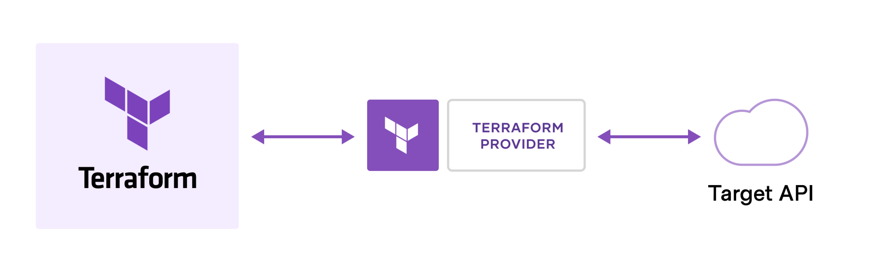

# Terraform: Introduction for developers

### Infrastructure as Code

Almost every software engineer has experienced that provisioning servers, operating systems, storage, and other infrastructure components is a demanding and time-consuming process. Provisioning is usually done manually, and when we take into account that in addition to the development environment, the staging and production workloads should also be deployed, we come to a large amount of work. In such a large task, human error can easily occur, which means that only a small configuration error can cause problems and disable the proper operation of the application.

To avoid potential outages we come to the concept of <b>Infrastructure as Code</b>. IaC is the managing and provisioning of infrastructure through code instead of through manual processes. Using the infrastructure as code allows configuration files on virtual machines, disks, network and other components to be stored together with the application code within source control management system. By storing them within the SCM allows you to version and track changes over time. This approach helps you to avoid undocumented, ad-hoc configuration changes.

Deploying your infrastructure as code also means that you can divide your infrastructure into modular components that can then be combined in different ways through automation. Automating infrastructure provisioning means that there is no need for manual interventions and thus eliminates the human error factor. There are several IaC tools and one of the most popular is <b>Terraform</b>.

### Terraform basic concepts

Terraform is HashiCorp's infrastructure as code tool. It lets you define resources and infrastructure in human-readable, declarative configuration files, and manages your infrastructure's lifecycle. It lets you define both cloud and on-premise resources trough configuration language called <b>HCL</b>, which looks like simplified JSON (JavaScript Object Notation). Terraform can manage low-level components like compute, storage, and networking resources, as well as high-level components like DNS entries and SaaS features.

But how does it all actually work under the hood? Terraform creates resources on cloud platforms and on-premises based on their application programming interfaces (APIs), while communication with APIs takes place through providers. Providers are plugins that interact with various platforms and manage their resources, serving as a logical abstraction of an upstream API.

Together with the community, Terraform has written more than 1800 providers, including those for major cloud providers like Azure, AWS and Google Cloud Platform. There are also providers for Docker, Kubernetes, Helm and more. You can find the full list at the [Terraform Registry](https://registry.terraform.io/).
